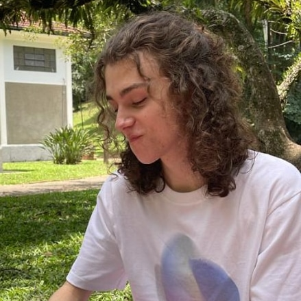

<!DOCTYPE html>
<html lang="en">
<head>
    <meta charset="UTF-8">
    <meta name="viewport" content="width=device-width, initial-scale=1.0">
    <title>Portfólio digital de João Vítor</title>
</head>
<body>

<h1>Portfólio digital de João Vítor</h1>

<h2> Orientador: Fabrício Galende Marques de Carvalho </h2>

<h3>Tecnologias utilizadas: GitHub, HTML e Markdown</h3>
</body>
</html>